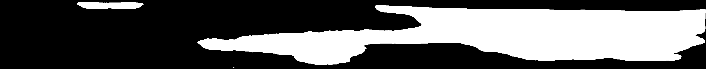

# Leaf Necrosis and Pycnidia Detection using Deep Learning
This project is a deep learning-based tool for detecting and classifying leaf necrosis and pycnidia in images of leaves. The tool is implemented using the OpenCV and TensorFlow libraries, and uses a pre-trained convolutional neural network to analyze the images.


### Necrosis Detection
The script starts by loading a pre-trained U-Net model that can detect necrosis on leaves. It then uses the model to process an image, resizing it and converting it to HSV color space. It then applies a mask to the image to isolate the leaf area and counts the number of necrosis in the image. The necrosis ratio is also calculated as the ratio of necrosis area to leaf area.

### Pycnidia Detection
The script then uses convolutional filters and image processing techniques to detect and classify pycnidia. The pycnidia ratio is also calculated as the ratio of pycnidia area to leaf area.

## Results
The script calculates various statistics about the leaf, such as the leaf area, necrosis area, necrosis ratio, pycnidia area, pycnidia ratio and saves the mask image for further analysis.

```
leaf,leaf_area_px,leaf_area_cm,necrosis_number,necrosis_area_ratio,necrosis_area_cm,pycnidia_number,pycnidia_area_px,pycnidia_area_cm,pycnidia_number_per_leaf_cm2,pycnidia_number_per_necrosis_cm2,pycnidia_area_cm2_per_necrosis_area_cm2,pycnidia_mean_area_cm2
9__1,680969.5,3.0181,2,0.707,2.1347,340,14938.5055,0.0662,112.65365627381465,159.27296575631235,0.03101138333255258,0.00019470588235294116
88__1,648293.5,2.8733,2,0.645,1.854,614,21092.5784,0.0935,213.691574148192,331.17583603020495,0.050431499460625674,0.00015228013029315962
14__1,638934.0,2.8318,1,0.855,2.4207,413,13490.1368,0.0598,145.84363302493114,170.6118065022514,0.024703598132771513,0.00014479418886198547
20__1,821680.5,3.6418,2,0.417,1.5194,13,570.0783,0.0025,3.569663353286836,8.55600895090167,0.00164538633671186,0.0001923076923076923
43__1,575263.5,2.5496,2,0.735,1.8736,438,18033.416,0.0799,171.79165359272042,233.7745516652434,0.04264517506404782,0.00018242009132420092
51__1,708187.0,3.1388,1,0.333,1.0439,197,7094.4192,0.0314,62.76283930164394,188.71539419484625,0.03007950953156432,0.00015939086294416242
25__1,637750.0,2.8266,1,0.644,1.8212,430,18773.0449,0.0832,152.12622939220265,236.10806061937186,0.045684164287283106,0.00019348837209302324
11__1,673435.5,2.9848,1,0.911,2.7184,598,25491.0139,0.113,200.34843205574913,219.9823425544438,0.04156856974690995,0.00018896321070234115
85__1,677470.0,3.0026,1,0.238,0.7154,269,11847.1915,0.0525,89.58902284686604,376.01341906625663,0.07338551859099804,0.00019516728624535316
50__1,704669.5,3.1232,4,0.463,1.4464,380,15119.8409,0.067,121.67008196721311,262.7212389380531,0.04632190265486726,0.00017631578947368423
```

## Requirements
1. Install [Python](https://www.python.org/downloads/)

2. Create a conda environment with the following command:
```bash
conda create -n septo-sympto python=3.9
```

3. Activate the environment with the following command:
```bash
conda activate septo-sympto
```

4. Install dependencies with the following command:
```bash
pip install -r requirements.txt
```

If necessary, you can install the YOLOv5 requirements that you can find in the [YOLOv5 repository](htts://github.com/ultralytics/yolov5).

5. Download the pre-trained models and place them in the "models" folder:
- [pycnidia-model.pt](https://drive.google.com/file/d/1WLIej7263MieoIrfGBtN7ljiZpE4NZy1/view?usp=share_link)
- [necrosis-model-375.h5](https://drive.google.com/file/d/1BPOsgdUjoA8uCGht4-kL2Er3SbB4JalR/view?usp=share_link)

6. Put your images in the "images" folder and your csv file in the "import" folder. Make sure yours images are in the horizontal axis.

7. Run the script with the following command line arguments:
```bash
python3 septo_sympto.py -w <images_folder> -i <csv_import> -o <csv_output> -nm <necrosis_model> -pm <pycnidia_model> -e <image_extension> -is <image_size> -d <device> -pt <pycnidia_threshold> -pn <necrosis_threshold> -sm <save_masks> -ns <no-save>
```

- `-w` or `--images_input` : specify the name of the folder containing the images. Default is 'images'.
- `-i` or `--import` : specify the name of the CSV file to import. Default is None.
- `-o` or `--output` : specify the name of the CSV file to output the results. Default is 'results.csv'.
- `-nm` or `--necrosis_model` : specify the path to the pre-trained necrosis model. Default is 'models/necrosis-model-375.h5'.
- `-pm` or `--pycnidia_model` : specify the path to the pre-trained pycnidia model. Default is 'models/pycnidia-model.pt'.
- `-e` or `--extension` : specify the extension of the images. Default is '.tif'.
- `-is` or `--imgsz` : specify the size of the images for inference. Default is [304, 3072].
- `-d` or `--device` : specify the device to use for inference. Can be 'cpu', 'mps' for M1&M2 or a number for specific GPU. Default is 'cpu'.
- `-pc` or `pixels_for_cm` : specify the number of pixels per cm. Default is 145.
- `-pt` or `--pycnidia_threshold` : specify the confidence threshold for pycnidia detection. Default is 0.3.
- `-pn` or `--necrosis_threshold` : specify the confidence threshold for necrosis detection. Default is 0.8.
- `-dm` or `draw_mode` : specify what to draw on the image. Can be 'pycnidia' 'necrosis'. Default is 'all'.
- `-sm` or `--save-masks` : specify if you want to save the masks. Default is False.
- `-ns` or `--no-save` : specify if you want to not save the image results in output folder. Default is False.

Tutorials: 
- [YOLOv5 model training](https://www.youtube.com/watch?v=19VbN6IK1zM&ab_channel=LauraMATHIEU)
- [U-Net model training](https://www.youtube.com/watch?v=KhGBcwwc-zQ&ab_channel=LauraMATHIEU)

For more informations:
- [YOLOv5](https://github.com/ultralytics/yolov5)

Datasets: [Septo-Sympto Datasets](https://drive.google.com/drive/folders/1a2VhXy-sMx77-BOHEgP7jXdWoIJI20s4?usp=sharing)

 

## Train weights

Two weights are provided in the models folder, `necrosis-model-375.h5` and `pycnidia-model.pt`, respectively for pycnidia detection and necrosis detection.

To train new weights for you application, please use the following tutorials : 
- Pycnidia (YOLOv5) : https://github.com/ultralytics/yolov5
- Necrosis (U-Net) : https://github.com/maximereder/unet

Necrosis and pycnidia are detected thanks to the SeptoSympto script, which cuts each leaf to be able to analyze them with deep learning models.

To run the image analysis, a folder must contain files called “images_input”, “csv_input”, “models”, “outputs”, “tools” and the script SeptoSympto available on https://github.com/maximereder/septo-sympto. The images in TIFF format and scanned at 1200 dpi are either directly usable by SeptoSympto if there are only horizontally scanned leaves on the image, or pre-cut and renamed with the XnView software if there are writings on the scanned images in order to have only horizontal leaves present on the input images. These images are stored in a folder called “images_input”. A file in csv format containing information for each image and the name of each image in the first column can be added in the file called “csv_input”. The deep learning-based models used for necrosis and pycnidia detection, respectively necrosis-model-375.h5 and pycnidia-model.pt, are stored in “models” folder. The “tools” folder contains a python script called “metrics.py” to calculate metrics for segmentation models and can also store other optional scripts.

The first function, in SeptoSympto script, detects each leaf that has a minimum area of 50000 pixels and a color range between [0, 35, 65] and [255, 255, 255] using the function **cv2.findContours**. The detected leaves are then cut with a rectangle encompassing the whole leaf, resized to a fixed size of 304 x 3072, renamed with the file name and the leaf number of the image and saved in a file called “cropped”. 

The second function, **predict_necrosis_mask**, predicts the probability of each pixel to be in necrosis class. To get a binary mask, we apply thresholds to keep only detected ones of more than 300 pixels and with a perimeter to area ratio of less than 0,8. The function returns a tuple containing the image with the necrosis contours drawn, the total area of necrosis and the necrosis number within the image. 

The third function, **predict_pycnidia**, uses the pycnidia model to predict rectangles and confidence from the analyzed image, and only retains pycnidia coordinates for those with a confidence level above the threshold of 0.3 and with a maximum number of pycnidia prediction per leaf of 10000. The function returns a tuple containing the image with the pycnidia contours drawn, the total area of pycnidia and the pycnidia number within the image.

After running the image analysis, we obtain the cropped images and output folder. In output, we have the result csv file containing both data imported and data calculated. We obtain the cropped images, the images with pycnidia and necrosis contours drawn and the measurements containing the leaf area, necrosis area, necrosis number, pycnidia area and pycnidia number in a csv file, saved in files called “cropped”, “images_output” and “results” respectively.

## YOLOv5 Custom Training

This guide explains how to train your own custom dataset with YOLOv5, quickly. For more information, see the [YOLOv5 documentation](https://github.com/ultralytics/yolov5).

### Prepare your dataset
In order to train a custom dataset with YOLOv5, you need to have labelled data. You can either manually prepare your dataset or use Roboflow to label, prepare and host your custom data automatically in YOLO format.

For more informations on how to prepare your dataset, see the [Roboblow](https://blog.roboflow.com/how-to-train-yolov5-on-a-custom-dataset/) tutorial.

Using Roboflow to prepare your dataset
Roboflow is a platform that provides tools to label and preprocess your data. Follow these steps to prepare your dataset using Roboflow:

1. **Sign up** or **log in** to Roboflow and create a new project indicating "Object Detection (Bounding Boxe)" type.
2. **Upload your images** to the dataset. Images should be in JPEG or PNG format.
3. **Annotate your images**. Roboflow supports various annotation formats, including bounding boxes, polygons and keypoints. For YOLOv5, choose "YOLOV5 Pytorch" as the export format. This will create a text file for each image with the same name as the image, containing the annotations in YOLO format.
4. **Apply preprocessing** options, if needed. Roboflow provides options such as resizing, rotation and augmentation to prepare your images for training.
5. **Export your dataset**. Roboflow will create a zip file containing your images, annotations and a YAML file with information about your dataset.

### Before You Start
1. Clone the YOLOv5 repository: git clone https://github.com/ultralytics/yolov5
2. Navigate to the cloned repository: cd yolov5
3. Install the requirements: `pip install -r requirements.txt`

### Folder structure and file types
Regardless of whether you use Roboflow or prepare your dataset manually, the folder structure and file types should follow these guidelines:

- Images should be stored in a folder named "images".
- Annotations should be stored in a folder named "labels".
- Each image should have a corresponding annotation file with the same name and ".txt" extension.
- The annotation files should contain the bounding box coordinates of each object in YOLO format: "class x_center y_center width height".

Here's an example of the contents of the "images" and "labels" folders:

```
├── dataset/
│   ├── images/
│   │   ├── image1.jpg
│   │   ├── image2.jpg
│   │   └── ...
│   ├── labels/
│   │   ├── image1.txt
│   │   ├── image2.txt
│   │   └── ...
```
### Annotation format
Each line of an annotation file should contain the information of one object in the image, with the following format:

```
<class> <x_center> <y_center> <width> <height>
```
- **class** is the integer index of the object class (starting from 0).
- **x_center** and **y_center** are the coordinates of the center of the bounding box relative to the width and height of the image (ranging from 0 to 1).
- **width** and **height** are the dimensions of the bounding box relative to the width and height of the image (also ranging from 0 to 1).

For example, if an image contains a dog and a cat, and the dog bounding box has coordinates (100, 150, 200, 250) and the cat bounding box has coordinates (50, 100, 150, 200), the annotation file should look like this:

```
0 0.416 0.520 0.250 0.333
0 0.260 0.387 0.188 0.333
```

where "0" is the class index for "pycnidia". The coordinates have been normalized relative to the width and height of the image.

### Train on Custom Data
1. **Create Dataset**: YOLOv5 models must be trained on labelled data. There are two options for creating your dataset:
    - Use [Roboflow](https://roboflow.com/) to label, prepare, and host your custom data automatically in YOLO format.
    - Manually prepare your dataset, see [Prepare your dataset](#prepare-your-dataset) section.

2. **Select a Model**: Select a pretrained model to start training from. For example, YOLOv5s is the second-smallest and fastest model available.
3. **Train**: Train a YOLOv5s model on COCO128 by specifying dataset, batch-size, image size and either pretrained --weights yolov5s.pt (recommended), or randomly initialized --weights '' --cfg yolov5s.yaml (not recommended).

```
python train.py --img <image_size> --batch <batch_size> --epochs <epochs> --data <data_yaml_file_path> --weights <weights_path>
```

Example: `python train.py --img 640 --batch 16 --epochs 3 --data coco128.yaml --weights yolov5s.pt`

You may adapt batch size and image size to your hardware. Indeed, the larger the batch the more memory it consumes. For example, if you have a 16GB GPU, you can train at batch size 32 and image size 640. If you have a 32GB GPU, you can train at batch size 64 and image size 1280. If you have a 64GB GPU, you can train at batch size 128 and image size 2560. If you have a 128GB GPU, you can train at batch size 256 and image size 5120.

4. **Visualize**: Track and visualize model metrics in real time using Comet Logging and Visualization or ClearML Logging and Automation.
    - Comet: `pip install comet_ml`
    - ClearML: `pip install clearml`

Training results are automatically logged with Tensorboard and CSV loggers to runs/train, with a new experiment directory created for each new training as runs/train/exp2, runs/train/exp3, etc.

## U-Net Custom Training

This guide explains how to train your own custom dataset with U-Net, quickly. For more information, see the [U-Net documentation](https://github.com/maximereder/unet).

### Prepare your dataset
In order to train a custom dataset with U-Net, you need to have labelled data. You can either manually prepare your dataset or use Roboflow to label, prepare and host your custom data automatically in semantic segmentation mask format.

For more informations on how to prepare your dataset, see the [Roboblow](https://blog.roboflow.com/semantic-segmentation-roboflow/) tutorial.

Using Roboflow to prepare your dataset
Roboflow is a platform that provides tools to label and preprocess your data. Follow these steps to prepare your dataset using Roboflow:

1. **Sign up** or **log in** to Roboflow and **create a new project** indicating "Semantic Segmentation" type.
2.**Upload your images** to the project. Images should be in JPEG or PNG format.
3. **Annotate your images**. Roboflow supports various annotation formats, including bounding boxes, polygons and keypoints. For U-Net, choose "Semantic Segmentation" as the export format. This will create a mask image for each annotated image, containing the segmentation information in grayscale.
4. **Apply preprocessing options**, if needed. Roboflow provides options such as resizing, rotation and augmentation to prepare your images and masks for training.
5. **Export your dataset**. Roboflow will create a zip file containing your images, masks and a YAML file with information about your dataset.

### Folder structure and file types
Regardless of whether you use Roboflow or prepare your dataset manually, the folder structure and file types should follow these guidelines:

- Images should be stored in a folder named "images".
- Masks should be stored in a folder named "masks".
- Each image should have a corresponding mask file with the same name and ".png" extension.
- The mask files should contain the segmentation information in grayscale.

Here's an example of the contents of the "images" and "masks" folders:

```
├── dataset/
│   ├── images/
│   │   ├── image1.jpg
│   │   ├── image2.jpg
│   │   └── ...
│   ├── masks/
│   │   ├── image1.png
│   │   ├── image2.png
│   │   └── ...
```

### Annotation format

Annotations are mask images containing the segmentation information in grayscale. In this project, the mask image should contain values between 0 or 255 (binary semantic segmentation).



### Before You Start
1. Clone the U-Net repository: https://github.com/maximereder/unet.git
2. Navigate to the cloned repository: `cd unet`

### Usage
To train a model, run the following command:

```
python train.py --data <data_folder> --csv <csv_output> --model <model_output> --epochs <epochs> --batch-size <batch_size> --img_ext <image_extension> --mask_ext <mask_extension> --imgsz <image_size>
```

You can also specify the following arguments:

- `--data`: Data folder name. Default: data
- `--csv`: CSV to output name. Default: results_unet_train.csv
- `--model`: Model to output name. Default: model.h5
- `--epochs`: Number of epochs for training. Default: 100
- `--batch-size`: Batch size for training. Default: 2
- `--img_ext`: Image extension. Default: .jpg
- `--mask_ext`: Masks extension. Default: .png
- `--imgsz`: Image size for inference. Default: [304, 3072]

## Authors

This script is based on the work of the following authors:
- Laura MATHIEU, PhD
    - Mail : laura.mathieu@supagro.fr 
    - Website : https://www.linkedin.com/in/laura-mathieu/
- Maxime REDER, Deep Learning Engineer
    - Mail : maximereder@live.fr 
    - Website : https://maximereder.fr

## License
This project is for personal use only and should not be distributed.