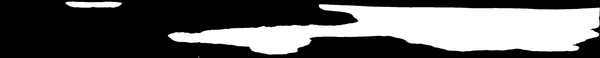

# SeptoSympto — quantification of Septoria tritici blotch symptoms

SeptoSympto is a deep learning tool that quantifies **necrosis** and **pycnidia** on scanned
wheat leaves infected by *Zymoseptoria tritici*. Leaf isolation and area measurement use
classical OpenCV image processing; the symptoms are measured by neural networks.


If you use SeptoSympto in your research, please [cite the paper](#citation).

> ### ⚠ This branch is a rewrite in progress
>
> **v2 has no runnable pipeline yet.** TensorFlow has been removed, and both models are being
> retrained. What exists today is the PyTorch U-Net architecture, the converted necrosis
> weights, and the packaging.
>
> **To reproduce the published results, use the v1 tag:**
>
> ```bash
> git checkout v1.0-legacy
> ```
>
> That tag is the implementation described in the paper. It runs `septo_sympto.py` on
> TensorFlow 2.15 (Python ≤ 3.11) and YOLOv5 v7.0. Read its
> [Known issues](#known-issues-and-limitations) before trusting its numbers: one CSV column is
> wrong, and necrosis area is underestimated by roughly 19 %.
>
> Everything below describes the v1 method, which v2 keeps, and the state of the migration.

---

## How it works

The v1 pipeline processes a folder of scanned images in three stages.

**1. Leaf isolation.** Each scan is thresholded in HSV space to separate leaf tissue from the
background. Contours larger than 50 000 px are treated as individual leaves, cropped to their
bounding box, and saved twice: once at native resolution (`cropped_not_resized`, used to
recover true areas) and once resized to 304 × 3072 px (`cropped`, fed to both models).

**2. Necrosis segmentation** (`predict_necrosis_mask`). The U-Net predicts, for every pixel,
the probability of belonging to a necrotic lesion. The probability map is binarised at the
`--necrosis_threshold` (default 0.8). Connected components are then filtered to keep only
those with an area above 300 px and a perimeter-to-area ratio below 0.9. The function returns
the total necrotic area and the number of lesions.

**3. Pycnidia detection** (`predict_pycnidia`). YOLOv5 predicts bounding boxes and confidence
scores. Boxes above `--pycnidia_threshold` (default 0.3) are retained, up to a maximum of
10 000 per leaf. The function returns the total pycnidia area and their count.

Areas measured in the 304 × 3072 working space are rescaled back to the native crop
resolution, then converted to cm² using `--pixels_for_cm` (default 472).

### Scale and leaf extent

Reference scans are TIFF at **1200 dpi**, which is 1200 / 2.54 = **472.44 px/cm**. That is
where the default of 472 comes from. v2 reads the resolution from the TIFF metadata instead
of taking it as an argument.

Leaves are laid horizontally and span the full width of the scan, so both tips fall outside
the image. `leaf_area_cm2` therefore measures **a standardised leaf segment**, not a whole
leaf. This is intentional and consistent across scans; all per-cm² densities are densities
over that segment. Two consequences worth keeping in mind when reporting: absolute leaf areas
are not whole-leaf areas, and scan widths vary (3078–3476 px in the reference set), so the
segment length is not identical from scan to scan.

---

## Results

### Leaf identity (v2)

v2 drops the `--import` metadata join. It was the source of two defects: the header declared
23 columns while each row wrote 19, so the four derived ratios were never emitted; and the
`leaf` column was overwritten with the scan name, making two leaves from the same scan
indistinguishable.

Instead, each leaf is identified by **two columns**, never by a parsed string:

| column | example | meaning |
|---|---|---|
| `image` | `Soi_LGA_2_Soi_1` | source scan, stem of the input filename |
| `leaf_index` | `2` | 1-based, in the order leaves are found on the scan |

A `leaf_id` of `Soi_LGA_2_Soi_1_2` can be composed for display, but nothing parses it back.
Scan names contain underscores, so a single-underscore identifier is ambiguous; v1 used a
double underscore (`Acc_Acc_4_Acc_1__2__1`) precisely to keep `split("__")[0]` working, and
the existing annotation filenames still rely on it. Two columns removes the problem rather
than encoding around it.

To attach experimental metadata, join on `image` downstream, in R or pandas, where a failed
join is visible instead of silently shifting columns.

### v1 output format

Results were written to `outputs/output_<n>/results.csv`:

```
leaf,leaf_area_px,leaf_area_cm2,necrosis_number,necrosis_area_ratio,necrosis_area_cm2,pycnidia_number,pycnidia_area_px,pycnidia_area_cm2,pycnidia_number_per_leaf_cm2,pycnidia_number_per_necrosis_cm2,pycnidia_area_cm2_per_necrosis_area_cm2,pycnidia_mean_area_cm2
9__1,680969.5,3.0181,2,0.707,2.1347,340,14938.5055,0.0662,112.65365627381465,159.27296575631235,0.03101138333255258,0.00019470588235294116
88__1,648293.5,2.8733,2,0.645,1.854,614,21092.5784,0.0935,213.691574148192,331.17583603020495,0.050431499460625674,0.00015228013029315962
14__1,638934.0,2.8318,1,0.855,2.4207,413,13490.1368,0.0598,145.84363302493114,170.6118065022514,0.024703598132771513,0.00014479418886198547
20__1,821680.5,3.6418,2,0.417,1.5194,13,570.0783,0.0025,3.569663353286836,8.55600895090167,0.00164538633671186,0.0001923076923076923
43__1,575263.5,2.5496,2,0.735,1.8736,438,18033.416,0.0799,171.79165359272042,233.7745516652434,0.04264517506404782,0.00018242009132420092
```

Alongside the CSV, the run directory contained `images_output/` (leaves with detections drawn)
and, when `--save-masks` was used, `masks/` (binary necrosis masks).

> **Note:** the example above was generated before a regression that currently affects the
> `pycnidia_number_per_leaf_cm2` column. See [Known issues](#known-issues-and-limitations).

---

## Installation

The project is managed with [Poetry](https://python-poetry.org/) and requires **Python 3.12
or 3.13**.

```bash
poetry install
```

This installs PyTorch, NumPy, OpenCV and pandas. It deliberately does **not** install
Ultralytics, which is AGPL-3.0: keeping it out of the default tree means a plain
`poetry install` yields an MIT-only dependency set. Install it explicitly when you need to
retrain or to experiment with YOLO segmentation heads:

```bash
poetry install --extras yolo
```

TensorFlow is gone. It is not an optional extra, not a legacy requirements file, not a
dependency of any kind. Everything at `v1.0-legacy` if you need to run the old pipeline.

### Pre-trained models

Training datasets and weights: [SeptoSympto Datasets](https://drive.google.com/drive/folders/1a2VhXy-sMx77-BOHEgP7jXdWoIJI20s4?usp=sharing)

The necrosis weights converted to PyTorch (`necrosis-model-375.safetensors`, 124 MB) are the
v1 weights, unchanged. They are the baseline that any retrained model has to beat.

> Hosting weights on Google Drive gives no versioning, no checksums, and links that expire.
> Moving them to Zenodo with a DOI, and downloading them on first run, is part of the v2 work.

---

## Usage

There is no v2 entry point yet. The pipeline is being rewritten around
`septosympto`, which currently exposes the necrosis model:

```python
import cv2, numpy as np, torch
from safetensors.torch import load_file
from septosympto.models import UNet

model = UNet().eval()
model.load_state_dict(load_file("data/necrosis-model-375.safetensors"))

leaf = cv2.resize(cv2.imread("leaf.jpg"), (3072, 304)).astype(np.float32) / 255.0
x = torch.from_numpy(leaf.transpose(2, 0, 1)[None].copy())
necrosis = model.predict(x).squeeze().numpy() > 0.8
```

For the full v1 command-line pipeline, its flags and its outputs, check out `v1.0-legacy` and
read the README there.

---

## Migration from TensorFlow to PyTorch

The necrosis U-Net was originally a Keras model (`necrosis-model-375.h5`, 31 055 297
parameters). It has been re-implemented layer for layer in PyTorch
(`septosympto/models/unet.py`) and the trained weights transferred into it, rather than
retrained. The port is therefore numerically equivalent, not merely comparable.

The conversion has been performed and its result committed as weights. The tooling that did it
lived under `tools/` and is preserved at `v1.0-legacy`, together with the TensorFlow
environment it needed. It is not carried into v2: TensorFlow will never be installed again,
and the five converted `.safetensors` files are the artifacts that matter.

Measured on six validation leaves at 304 × 3072, comparing Keras 2.15 on Python 3.11 against
PyTorch 2.13 on Python 3.12:

| quantity | deviation |
|---|---|
| max absolute difference on probabilities | 7.0 × 10⁻⁶ |
| mean absolute difference | 2.1 × 10⁻⁸ |
| pixels disagreeing at threshold 0.5 and 0.8 | 0 |
| **relative error on necrosis area** | **0.000000 %** |

The two Keras conventions that must be reproduced are `BatchNormalization(epsilon=1e-3)`
— PyTorch defaults to `1e-5` — and the decoder concatenation order `[upsampled, skip]`.
Both are enforced by the tests in `tests/test_unet.py`.

The safetensors artifact is 124 MB against 372 MB for the `.h5`, which carried the optimiser
state. It loads under any recent PyTorch, with no TensorFlow present.

### The pycnidia detector will be retrained, not ported

`pycnidia-model.pt` was trained with the `ultralytics/yolov5` repository. It cannot be
carried into the modern stack, and this is not a packaging detail that a flag can fix:

- PyTorch ≥ 2.6 defaults `torch.load` to `weights_only=True` and refuses to deserialise it.
- The current `ultralytics` package detects the checkpoint and rejects it outright: *"appears
  to be an Ultralytics YOLOv5 model originally trained with .../yolov5. This model is NOT
  forwards compatible."* The old detection head is anchor-based; the current one is
  anchor-free. The head weights have no counterpart. The `yolov5su.pt` models that Ultralytics
  ships are retrained re-implementations, not the same weights.

Rather than freeze a bridge around a model that is already slated for replacement, the
pycnidia detector will be **retrained** on `data/pycnidia/` with a current architecture. The
annotations are points in all but name — the median bounding box is 4 × 4 px — which is the
real reason a plain object detector is the wrong tool here.

Until that lands, the v1 pipeline at `v1.0-legacy` remains the reference implementation.

---

## Known issues and limitations

These are open defects in the current release, documented here pending the ongoing rework.
None of them prevent the tool from running.

**The `--import` join drops four columns.** When a metadata CSV was supplied, `export_result`
wrote a header of 23 columns but only 19 values per row. `pycnidia_number_per_leaf_cm2`,
`pycnidia_number_per_necrosis_cm2`, `pycnidia_area_cm2_per_necrosis_area_cm2` and
`pycnidia_mean_area_cm2` were never written. The `leaf` column also received the scan name
stripped of its `__n` suffix, so leaves from the same scan produced identical, indistinguishable
rows. Any analysis run through the `--import` path is affected. v2 removes the join entirely.

**Wrong CSV column.** Without `--import`, since February 2023 the column labelled `pycnidia_number_per_leaf_cm2`
actually contains `necrosis_area_cm2 / leaf_area_cm2` — that is, a duplicate of
`necrosis_area_ratio`. The intended metric (pycnidia count per cm² of leaf) is not currently
emitted. Results produced since then should not rely on that column.

**Boolean flags behave inversely.** `--save-masks` and `--no-save` are parsed as strings, so
passing *any* value — including `False` — is interpreted as true. Omit the flag entirely to
get the default behaviour.

**Necrosis area is underestimated.** On the 67 validation leaves carrying necrosis, the
shipped `necrosis-model-375.h5` recovers about 81 % of the annotated necrotic area
(95 % CI [0.69, 0.95]). Binary Dice is 0.76 and IoU 0.67. Absolute necrotic areas are
therefore biased low; relative comparisons between treatments are much less affected.
A clean held-out test set is being assembled to select the operating point properly.

**Training-log metrics understate the models.** The Roboflow masks encode necrosis as magenta
`(255, 0, 124)`. Read as greyscale and divided by 255, the target becomes 0.354 rather than
1.0, which caps the achievable Dice at roughly 0.52. The `val_dice_coef` values in
`data/necrosis/results/*.csv` must be read with that ceiling in mind; the real binary Dice is
around 0.76–0.82.

**Leaf area is double-counted.** `get_leaf_area` sums the areas of all contours returned with
`RETR_TREE`, so internal holes are added rather than subtracted.

**Crops accumulate across runs.** Cropped leaves are written into `images/cropped/`, and the
inference loop iterates over everything found there. Running on a second batch without
clearing the folder will silently include leaves from the previous batch. **Delete
`images/cropped/` and `images/cropped_not_resized/` between runs.**

**Aspect ratio is not preserved, and the distortion tracks a genotypic trait.** Every leaf is
resized to a fixed 304 × 3072 regardless of its true proportions. Because leaves span the full
scan width, the horizontal scale barely changes (×0.88 to ×1.00); the entire distortion falls
on the vertical axis and is governed by one thing, leaf thickness.

Measured on 27 leaves from 7 reference scans, whose heights range from 169 to 398 px (a factor
of 2.4):

| | value |
|---|---|
| median anisotropy of the resize | 1.23 |
| 90th percentile | 1.64 |
| maximum | 1.94 |
| leaves distorted by more than 25 % | 12 / 27 |

A circular 6 px pycnidium becomes a 6 × 7.4 px ellipse on a median leaf, and 6 × 11.6 px on
the thinnest. Leaf thickness is a varietal trait, so the measurement distortion is confounded
with the genotype being compared.

The area arithmetic is sound: `convert_model_to_base_area` rescales areas exactly. What is
biased is the segmentation and detection performed upstream, in the distorted space. Working
at native resolution with tiling is the fix, and it is a v2 goal.

---

## Training (v2)

The `train/` package retrains the necrosis segmenter from scratch. It is kept out of the
shipped `septosympto` package — installing the tool for inference does not pull Modal or the
training loop:

```bash
poetry install --with train
```

Everything runs locally and is tested locally; Modal is a thin launcher over the same
functions, not where the logic lives.

Two things it does that v1's training did not. Masks are **binarised**, not read as
greyscale and divided by 255 — the bug that capped the reported Dice at 0.523. And the split
is **grouped by scan**: all 375 images are pooled and re-partitioned so no scan has leaves in
two folds, with a held-out test set that no training step touches. Validation each epoch goes
through `septosympto.eval`, so the metric that selects the checkpoint is the real binary Dice,
and the **area bias is logged next to it** — the quantity whose neglect shipped a model
under-recovering necrotic area by 19 %.

### Local

```bash
poetry run python -m train.run \
    --dataset data/necrosis/dataset/300.zip \
    --run-name necrosis-v2 --epochs 100 --device mps
```

`imgsz` must be divisible by 16 (the 4-level U-Net pools four times); the reference size is
`304 3072`. Outputs land in `runs/<run-name>/`: `best.safetensors` and a `manifest.json`
recording the config, the git commit, the split sizes, and the full per-epoch history.

### On a GPU with Modal

```bash
modal run train/modal_app.py \
    --dataset data/necrosis/dataset/300.zip \
    --run-name necrosis-v2 --epochs 100 --gpu A10
```

The dataset zip is uploaded once into a Modal Volume; checkpoints are written to a second
Volume that outlives the container. Requires a configured Modal account.

### Pycnidia counting

Counting is a separate task from segmentation, so it has its own loop, data loader, and model
registry. Pycnidia are ~4 px discs, hundreds per leaf: the YOLO boxes are points in all but
name, and only their centres are used. There is no single output format across counting
architectures — a heatmap, a density map and a P2P point-set network differ in output, target
and loss — so a counter **owns its own `loss(output, points)` and `decode(output) -> points`**,
and the loop is identical across all of them. Two are registered:

- **`heatmap`** — a stride-4 keypoint detector. Simple and robust, but its heatmap grid merges
  pycnidia closer than the Gaussian window into one peak, so it under-counts dense leaves.
- **`p2p`** — a point-set network (P2PNet) with a VGG backbone and Hungarian matching. Points
  are explicit predictions, not grid peaks, so touching pycnidia stay separate. Heavier
  (VGG at full resolution) and slower (matching runs per image, ~0.2–0.4 s), but built for
  exactly this density. Its VGG weights download on first use unless constructed with
  `pretrained=False`.

Both satisfy the same three-method contract, so `--arch heatmap` and `--arch p2p` train
through the same loop, data, and evaluation, and `counting_report` compares them on the same
held-out leaves.

```bash
poetry run python -m train.count_run \
    --dataset-dir data/pycnidia/train-200-aug-x3 data/pycnidia/valid-40 \
    --arch heatmap --run-name pycnidia-v2 --epochs 100 --device mps
```

The pre-augmented Roboflow directories are pooled, **deduplicated by leaf** (the mirror copies
that leaked in v1 collapse to one), and re-split grouped by scan. Each epoch reports MAE on the
count — the biological quantity that drives checkpoint selection — with localisation
precision/recall/F1 beside it. To add another counting architecture: define it in
`septosympto/models/`, decorate it `@register_counter("name")`, give it `forward` / `loss` /
`decode`, and train it with `--arch name`.

### Training P2P on the largest pycnidia set, on a Modal GPU

The `p2p` architecture wants a GPU: a VGG backbone plus Hungarian matching is heavier than the
local smoke can show. The Modal setup follows a push-then-run convention — data is uploaded to
a volume once, out of band, and the worker reads it and fails fast if it is missing, so nothing
uploads on a run's hot path.

```bash
scripts/push_data.sh pycnidia
```

This uploads the pycnidia directories to the `septosympto-data` volume via `modal volume put`.
Then launch the run. The largest available set is `train-200-aug-x3` pooled with `valid-40`
(219 unique leaves after dedup), which is the default:

```bash
modal run train/modal_app.py::pycnidia \
    --arch p2p --run-name pyc-p2p \
    --epochs 200 --batch-size 4 --gpu A100-40GB
```

The checkpoint lands in the `septosympto-runs` volume at `pyc-p2p/best.safetensors`, with a
manifest recording the config, git commit, scan-grouped split sizes, and per-epoch MAE/F1.
P2PNet's pretrained VGG downloads once into a `septosympto-cache` volume under `TORCH_HOME` and
persists. VGG at full resolution is memory-heavy: the default trains at 200×2048 with batch 4;
raise the batch or the resolution on an H100. Swap `--arch p2p` for `--arch heatmap` to train
the lighter baseline and compare — `counting_report` scores both on the same held-out leaves.

The same launcher trains necrosis: `modal run train/modal_app.py::necrosis --run-name nec-v2`.
Requires a configured Modal account.

## Training the original weights (v1)

The models shipped with the paper were trained outside this repository, with the external
YOLOv5 and U-Net projects below. This is kept for provenance; new necrosis training goes
through `train/` above.

### Pycnidia — YOLOv5

Annotate with bounding boxes and export in *YOLOv5 PyTorch* format (e.g. via
[Roboflow](https://blog.roboflow.com/how-to-train-yolov5-on-a-custom-dataset/)). The dataset
layout is one `.txt` per image, sharing its basename:

```
dataset/
├── images/
│   ├── image1.jpg
│   └── ...
└── labels/
    ├── image1.txt
    └── ...
```

Each annotation line is `<class> <x_center> <y_center> <width> <height>`, with coordinates
normalised to [0, 1] and `class` = 0 for pycnidia.

```bash
git clone https://github.com/ultralytics/yolov5
cd yolov5 && pip install -r requirements.txt
python train.py --img <image_size> --batch <batch_size> --epochs <epochs> \
                --data <data.yaml> --weights yolov5s.pt
```

The shipped weights were trained from `yolov5x6.pt` for 400 epochs at `--img 3070`,
`--batch 12`, `--rect`. Larger batches and image sizes need proportionally more GPU memory.

Video tutorial: [YOLOv5 model training](https://www.youtube.com/watch?v=19VbN6IK1zM&ab_channel=LauraMATHIEU)
Reference: [YOLOv5](https://github.com/ultralytics/yolov5)

### Necrosis — U-Net

Annotate with semantic segmentation masks and export one `.png` per image. Masks must be
**binary** (0 or 255).



> If you export from Roboflow, verify the encoding: Roboflow writes coloured masks, not
> binary ones. Converting a coloured mask to greyscale silently rescales the positive class
> and corrupts the training target. Binarise explicitly.

```
dataset/
├── images/
│   ├── image1.jpg
│   └── ...
└── masks/
    ├── image1.png
    └── ...
```

```bash
git clone https://github.com/maximereder/unet.git
cd unet
python train.py --data <data_folder> --csv <csv_output> --model <model_output> \
                --epochs <epochs> --batch-size <batch_size> --imgsz 304 3072
```

Arguments: `--data` (default `data`), `--csv` (default `results_unet_train.csv`), `--model`
(default `model.h5`), `--epochs` (default 100), `--batch-size` (default 2), `--img_ext`
(default `.jpg`), `--mask_ext` (default `.png`), `--imgsz` (default `304 3072`).

Video tutorial: [U-Net model training](https://www.youtube.com/watch?v=KhGBcwwc-zQ&ab_channel=LauraMATHIEU)
Reference: [U-Net](https://github.com/maximereder/unet)

---

## Citation

If you use SeptoSympto, please cite:

> Mathieu, L., Reder, M., Siah, A., Ducasse, A., Langlands-Perry, C., Marcel, T. C.,
> Morel, J.-B., Saintenac, C., & Ballini, E. (2024). SeptoSympto: a precise image analysis of
> Septoria tritici blotch disease symptoms using deep learning methods on scanned images.
> *Plant Methods*, 20(1), 18. https://doi.org/10.1186/s13007-024-01136-z

```bibtex
@article{mathieu2024septosympto,
  title    = {SeptoSympto: a precise image analysis of Septoria tritici blotch disease
              symptoms using deep learning methods on scanned images},
  author   = {Mathieu, Laura and Reder, Maxime and Siah, Ali and Ducasse, Aur{\'e}lie
              and Langlands-Perry, Camilla and Marcel, Thierry C. and Morel, Jean-Beno{\^i}t
              and Saintenac, Cyrille and Ballini, Elsa},
  journal  = {Plant Methods},
  volume   = {20},
  number   = {1},
  pages    = {18},
  year     = {2024},
  doi      = {10.1186/s13007-024-01136-z}
}
```

---

## Authors

- **Laura Mathieu**, PhD — laura.mathieu@supagro.fr — [LinkedIn](https://www.linkedin.com/in/laura-mathieu/)
- **Maxime Reder**, Deep Learning Engineer — maximereder@live.fr — [maximereder.fr](https://maximereder.fr)

See the [publication](https://doi.org/10.1186/s13007-024-01136-z) for the full author list.

## License

The SeptoSympto source code is released under the [MIT License](LICENSE).

The pycnidia weights (`pycnidia-model.pt`) were trained with Ultralytics YOLOv5 and are
distributed under **AGPL-3.0**, not MIT. See [NOTICE](NOTICE) for the full third-party
license breakdown and its practical consequences.

The associated article is published under CC BY 4.0.
