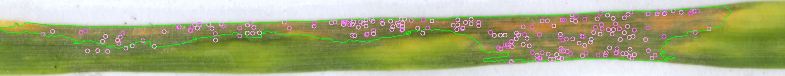

# SeptoSympto — quantification of Septoria tritici blotch symptoms

SeptoSympto quantifies **necrosis** and **pycnidia** on scanned wheat leaves infected by
*Zymoseptoria tritici*. Leaf isolation and area measurement use classical OpenCV image
processing; the symptoms are measured by neural networks.



Point it at a folder of scans and it writes one CSV row per leaf.

```bash
poetry install --extras yolo
poetry run septo-sympto scans/ -o results.csv --pycnidia p2p-convnext-v3
```

If you use SeptoSympto in your research, please [cite the paper](#citation).

| | |
|---|---|
| **[Training](docs/training.md)** | retraining the models, scoring them, rebuilding the datasets |
| **[v1 archive](docs/v1.md)** | the published method, its known defects, and what v2 changed |
| **[Leaderboard](LEADERBOARD.md)** | every scored run, and the protocol a new row must follow |

> **This branch is a rewrite in progress.** v2 runs end to end and both models have been
> retrained, but it is not released: `pyproject.toml` is at `2.0.0.dev0` and the API may still
> move. To reproduce the numbers in the paper, use the `v1.0-legacy` tag — see
> [docs/v1.md](docs/v1.md).

---

## How it works

Each scan is thresholded in HSV space to separate leaf tissue from the background; contours
large enough to be a leaf are cropped out and indexed in the order they are found. Every leaf
is then letterboxed — **not stretched** — onto a shared 3072 × 384 canvas at native
resolution, which is the geometry both models were trained on, and the predictions are mapped
back to the leaf's own pixels through the inverse of that same placement.

The necrosis segmenter returns a probability per pixel, binarised at the model's threshold;
connected components smaller than `--min-lesion-area-mm2` are dropped. The pycnidia counter
returns explicit points, not boxes: the annotations it learned from have a median bounding box
of 4 × 4 px, so a point-set network is the honest model for them.

Areas are converted to cm² using the scan's own resolution, read from the TIFF metadata.

---

## Installation

SeptoSympto requires **Python 3.12 or 3.13** — not 3.14, not the 3.9 that ships with macOS.
`python3 --version` tells you what you have. If it is not one of those two, install one; with
[Homebrew](https://brew.sh) on macOS:

```bash
brew install python@3.13
```

Elsewhere, take the installer from [python.org](https://www.python.org/downloads/) (Windows,
older Linux) — Ubuntu 24.04 already ships 3.12.

The project is managed with [Poetry](https://python-poetry.org/), **2.0 or newer** (1.x does
not read this `pyproject.toml`). It is a tool, not a dependency, so it is installed once,
outside the project:

```bash
brew install poetry                                     # macOS with Homebrew
curl -sSL https://install.python-poetry.org | python3 -  # anywhere else
```

Then fetch the code, point Poetry at the right interpreter, and install:

```bash
git clone https://github.com/maximereder/septo-sympto.git
cd septo-sympto
git checkout refactor/modernization   # v2 is not merged into main yet
poetry env use python3.13      # or python3.12 — whichever you installed
poetry install
```

This installs PyTorch, NumPy, OpenCV and pandas. It deliberately does **not** install
Ultralytics, which is AGPL-3.0: keeping it out of the default tree means a plain
`poetry install` yields an MIT-only dependency set. Install it explicitly when you need to
retrain or to experiment with YOLO segmentation heads — the default necrosis model is a YOLO,
so in practice you want it:

```bash
poetry install --extras yolo
```

Every command in this repository — the CLI, the tools, the training launchers — runs through
Poetry, so the environment is always the one the lockfile describes:

```bash
poetry run septo-sympto --list-models
```

Prefer to drop the prefix? Activate the environment once (`eval $(poetry env activate)`) and
`septo-sympto` is on your PATH for that shell. The docs keep `poetry run` because it works
either way.

TensorFlow is gone — not an optional extra, not a legacy requirements file, not a
dependency of any kind. The published v1 implementation lives at the `v1.0-legacy` tag and
is documented in [docs/v1.md](docs/v1.md).

## Models

Models are published by **name** and fetched on first use. `septo-sympto --list-models` shows
what is available, what each was validated at, and what it scored on the held-out test fold:

| name | task | what it is | threshold | test score |
|---|---|---|---|---|
| `yolo26s-v2` (default) | necrosis | YOLO26s-sem trained on the 278-leaf native set | 0.3 | Dice 0.694, area ratio 1.02 |
| `unet-v1` | necrosis | the published 2023 U-Net, ported weight-for-weight | 0.8 | Dice 0.611, area ratio 0.77 — *not uploaded* |
| `p2p-convnext-v3` | pycnidia | P2PNet/ConvNeXt-T on the corrected labels | 0.2 | MAE 33.8, slope 0.94, F1 0.739 |
| `p2p-convnext-v2` | pycnidia | the same, on the pre-correction labels — *superseded* | 0.3 | MAE 65.2 there, 36.3 at 0.5 — *not uploaded* |

Weights live on the Hugging Face Hub at
[`maximereder/septo-sympto`](https://huggingface.co/maximereder/septo-sympto), downloaded once into
`~/.cache/septosympto/models/` (`SEPTOSYMPTO_HOME` overrides) and verified against their
SHA-256 on every load — a download whose digest does not match is refused, never used. The
catalogue is `septosympto/zoo.py`; a model gets in by being promoted from `LEADERBOARD.md`.
Training datasets remain on
[Google Drive](https://drive.google.com/drive/folders/1a2VhXy-sMx77-BOHEgP7jXdWoIJI20s4?usp=sharing).

**Two cards are not backed by a file yet.** `unet-v1` and `p2p-convnext-v2` are listed, and
`--list-models` marks them `NOT UPLOADED`, but asking for one 404s on any machine whose cache
is empty. Both are kept on purpose: `unet-v1` is the published model and belongs in the
catalogue, `p2p-convnext-v2` documents what the annotation correction replaced.

`p2p-convnext-v3` counts pycnidia at **threshold 0.20**, not the 0.3 its predecessor carried:
on the same 29 test leaves, v2 reaches MAE 36.3 at best (threshold 0.5) and gets there by
under-counting the loaded leaves — slope 0.807 against 0.939. How both were trained is in
[docs/training.md](docs/training.md#pycnidia-counting).

---

## Usage

Point it at a directory of scans. With no other option it uses the default models and reads
the scale from each TIFF's resolution tag:

```bash
poetry run septo-sympto scans/ -o results.csv
```

```
necrosis: yolo26s-v2 (threshold 0.3)
pycnidia: none
Acc_Acc_1_Acc_1.tif: 4 leaves
...
132 leaves from 33 scans -> results.csv
```

Choosing models — a published name or a checkpoint path, per task:

```bash
poetry run septo-sympto scans/ --necrosis unet-v1 -o v1.csv               # the 2023 model, for comparison
poetry run septo-sympto scans/ --necrosis runs/my-run/weights/best.pt -pn 0.3      # an unpublished YOLO run
poetry run septo-sympto scans/ --necrosis runs/r18/best.safetensors --necrosis-arch unet-resnet18 -pn 0.5
poetry run septo-sympto --list-models
```

Counting pycnidia too — the name carries the architecture and the threshold:

```bash
poetry run septo-sympto scans/ -o results.csv -d mps --pycnidia p2p-convnext-v3
```

A published name carries its own threshold; a path needs `--necrosis-threshold` /
`--pycnidia-threshold` (and, for `.safetensors`, the architecture) because nothing else knows
what the checkpoint was validated at. Other options: `-e .tiff` for the input extension,
`-pc 472.44` to force a scale when a scan carries none, `--min-lesion-area-mm2`, `--masks-dir`
to also write a necrosis mask and overlay per leaf, `-d mps` / `-d 0` for the device.

YOLO models need the `yolo` extra (`poetry install --extras yolo`); asking for one without it
says so and stops. The pycnidia columns stay empty unless `--pycnidia` names a counter, which
is off by default.

---

## What the numbers mean

One row per leaf:

```
image,leaf_index,px_per_cm,qc,leaf_area_px,leaf_area_cm2,necrosis_count,necrosis_area_px,
necrosis_area_cm2,necrosis_area_ratio,pycnidia_count,pycnidia_per_leaf_cm2,
pycnidia_per_necrosis_cm2
```

Beside the CSV, a manifest records which weights (name **and** SHA-256) and which parameters
produced it, so a result can be traced back to the exact model that made it.

### What `leaf_area_cm2` measures

Reference scans are TIFF at **1200 dpi**, which is 1200 / 2.54 = **472.44 px/cm**. That is
where the default of 472 comes from. The resolution is read from the TIFF metadata instead
of taking it as an argument.

Leaves are laid horizontally and span the full width of the scan, so both tips fall outside
the image. `leaf_area_cm2` therefore measures **a standardised leaf segment**, not a whole
leaf. This is intentional and consistent across scans; all per-cm² densities are densities
over that segment. Two consequences worth keeping in mind when reporting: absolute leaf areas
are not whole-leaf areas, and scan widths vary (3078–3476 px in the reference set), so the
segment length is not identical from scan to scan.

### Identifying a leaf

Each leaf is identified by **two columns**, never by a parsed string:

| column | example | meaning |
|---|---|---|
| `image` | `Soi_LGA_2_Soi_1` | source scan, stem of the input filename |
| `leaf_index` | `2` | 1-based, in the order leaves are found on the scan |

A `leaf_id` of `Soi_LGA_2_Soi_1_2` can be composed for display, but nothing parses it back:
scan names contain underscores, so a single-underscore identifier is ambiguous. Two columns
removes the problem rather than encoding around it.

To attach experimental metadata, join on `image` downstream, in R or pandas, where a failed
join is visible instead of silently shifting columns.

---

## Citation

If you use SeptoSympto, please cite:

> Mathieu, L., Reder, M., Siah, A., Ducasse, A., Langlands-Perry, C., Marcel, T. C.,
> Morel, J.-B., Saintenac, C., & Ballini, E. (2024). SeptoSympto: a precise image analysis of
> Septoria tritici blotch disease symptoms using deep learning methods on scanned images.
> *Plant Methods*, 20(1), 18. https://doi.org/10.1186/s13007-024-01136-z

```bibtex
@article{mathieu2024septosympto,
  title    = {SeptoSympto: a precise image analysis of Septoria tritici blotch disease
              symptoms using deep learning methods on scanned images},
  author   = {Mathieu, Laura and Reder, Maxime and Siah, Ali and Ducasse, Aur{\'e}lie
              and Langlands-Perry, Camilla and Marcel, Thierry C. and Morel, Jean-Beno{\^i}t
              and Saintenac, Cyrille and Ballini, Elsa},
  journal  = {Plant Methods},
  volume   = {20},
  number   = {1},
  pages    = {18},
  year     = {2024},
  doi      = {10.1186/s13007-024-01136-z}
}
```

---

## Authors

- **Laura Mathieu**, PhD — laura.mathieu@supagro.fr — [LinkedIn](https://www.linkedin.com/in/laura-mathieu/)
- **Maxime Reder**, Deep Learning Engineer — maximereder@live.fr — [maximereder.fr](https://maximereder.fr)

See the [publication](https://doi.org/10.1186/s13007-024-01136-z) for the full author list.

## License

The SeptoSympto source code is released under the [MIT License](LICENSE).

The pycnidia weights (`pycnidia-model.pt`) were trained with Ultralytics YOLOv5 and are
distributed under **AGPL-3.0**, not MIT. See [NOTICE](NOTICE) for the full third-party
license breakdown and its practical consequences.

The associated article is published under CC BY 4.0.
