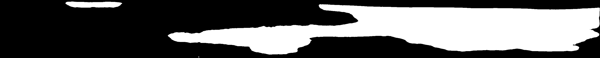

# SeptoSympto v1 — the published method, and what v2 changed

This is the archive. It describes the implementation behind the
[2024 paper](https://doi.org/10.1186/s13007-024-01136-z), the defects found in it, and how its
weights were trained. **None of it describes how v2 behaves today** — for that, read the
[README](../README.md).

It is kept because it is what the paper documents, and because v2's design is a series of
answers to the problems recorded here. To run the published implementation:

```bash
git checkout v1.0-legacy
```

That tag runs `septo_sympto.py` on TensorFlow 2.15 (Python <= 3.11) and YOLOv5 v7.0.

---

## The v1 pipeline

The v1 pipeline processes a folder of scanned images in three stages.

**1. Leaf isolation.** Each scan is thresholded in HSV space to separate leaf tissue from the
background. Contours larger than 50 000 px are treated as individual leaves, cropped to their
bounding box, and saved twice: once at native resolution (`cropped_not_resized`, used to
recover true areas) and once resized to 304 × 3072 px (`cropped`, fed to both models).

**2. Necrosis segmentation** (`predict_necrosis_mask`). The U-Net predicts, for every pixel,
the probability of belonging to a necrotic lesion. The probability map is binarised at the
`--necrosis_threshold` (default 0.8). Connected components are then filtered to keep only
those with an area above 300 px and a perimeter-to-area ratio below 0.9. The function returns
the total necrotic area and the number of lesions.

**3. Pycnidia detection** (`predict_pycnidia`). YOLOv5 predicts bounding boxes and confidence
scores. Boxes above `--pycnidia_threshold` (default 0.3) are retained, up to a maximum of
10 000 per leaf. The function returns the total pycnidia area and their count.

Areas measured in the 304 × 3072 working space are rescaled back to the native crop
resolution, then converted to cm² using `--pixels_for_cm` (default 472).

---

### v1 output format

Results were written to `outputs/output_<n>/results.csv`:

```
leaf,leaf_area_px,leaf_area_cm2,necrosis_number,necrosis_area_ratio,necrosis_area_cm2,pycnidia_number,pycnidia_area_px,pycnidia_area_cm2,pycnidia_number_per_leaf_cm2,pycnidia_number_per_necrosis_cm2,pycnidia_area_cm2_per_necrosis_area_cm2,pycnidia_mean_area_cm2
9__1,680969.5,3.0181,2,0.707,2.1347,340,14938.5055,0.0662,112.65365627381465,159.27296575631235,0.03101138333255258,0.00019470588235294116
88__1,648293.5,2.8733,2,0.645,1.854,614,21092.5784,0.0935,213.691574148192,331.17583603020495,0.050431499460625674,0.00015228013029315962
14__1,638934.0,2.8318,1,0.855,2.4207,413,13490.1368,0.0598,145.84363302493114,170.6118065022514,0.024703598132771513,0.00014479418886198547
20__1,821680.5,3.6418,2,0.417,1.5194,13,570.0783,0.0025,3.569663353286836,8.55600895090167,0.00164538633671186,0.0001923076923076923
43__1,575263.5,2.5496,2,0.735,1.8736,438,18033.416,0.0799,171.79165359272042,233.7745516652434,0.04264517506404782,0.00018242009132420092
```

Alongside the CSV, the run directory contained `images_output/` (leaves with detections drawn)
and, when `--save-masks` was used, `masks/` (binary necrosis masks).

> **Note:** the example above was generated before a regression that currently affects the
> `pycnidia_number_per_leaf_cm2` column. See [Defects of the published implementation](#defects-of-the-published-implementation).

---

## Migration from TensorFlow to PyTorch

The necrosis U-Net was originally a Keras model (`necrosis-model-375.h5`, 31 055 297
parameters). It has been re-implemented layer for layer in PyTorch
(`septosympto/models/unet.py`) and the trained weights transferred into it, rather than
retrained. The port is therefore numerically equivalent, not merely comparable.

The conversion has been performed and its result committed as weights. The tooling that did it
lived under `tools/` and is preserved at `v1.0-legacy`, together with the TensorFlow
environment it needed. It is not carried into v2: TensorFlow will never be installed again,
and the five converted `.safetensors` files are the artifacts that matter.

Measured on six validation leaves at 304 × 3072, comparing Keras 2.15 on Python 3.11 against
PyTorch 2.13 on Python 3.12:

| quantity | deviation |
|---|---|
| max absolute difference on probabilities | 7.0 × 10⁻⁶ |
| mean absolute difference | 2.1 × 10⁻⁸ |
| pixels disagreeing at threshold 0.5 and 0.8 | 0 |
| **relative error on necrosis area** | **0.000000 %** |

The two Keras conventions that must be reproduced are `BatchNormalization(epsilon=1e-3)`
— PyTorch defaults to `1e-5` — and the decoder concatenation order `[upsampled, skip]`.
Both are enforced by the tests in `tests/test_unet.py`.

The safetensors artifact is 124 MB against 372 MB for the `.h5`, which carried the optimiser
state. It loads under any recent PyTorch, with no TensorFlow present.

### The pycnidia detector was retrained, not ported

`pycnidia-model.pt` was trained with the `ultralytics/yolov5` repository. It could not be
carried into the modern stack, and this was not a packaging detail that a flag could fix:

- PyTorch ≥ 2.6 defaults `torch.load` to `weights_only=True` and refuses to deserialise it.
- The current `ultralytics` package detects the checkpoint and rejects it outright: *"appears
  to be an Ultralytics YOLOv5 model originally trained with .../yolov5. This model is NOT
  forwards compatible."* The old detection head is anchor-based; the current one is
  anchor-free. The head weights have no counterpart. The `yolov5su.pt` models that Ultralytics
  ships are retrained re-implementations, not the same weights.

Rather than freeze a bridge around a model already slated for replacement, the pycnidia
detector was **retrained**. The annotations are points in all but name — the median bounding
box is 4 × 4 px — which is the real reason a plain object detector was the wrong tool, so what
replaced it is a point-set counter (P2PNet), trained on the undistorted `data/leaves-native/`
canvases rather than the stretched `data/pycnidia/` strips. See
[Pycnidia counting](training.md#pycnidia-counting).

The v1 pipeline at `v1.0-legacy` remains the reference implementation for the published paper.

---

## Defects of the published implementation

Every one of these is a defect of v1. The table in [what v2 fixes](#what-v2-fixes)
says where each one stands today; none of them prevent v1 from running.

**The `--import` join drops four columns.** When a metadata CSV was supplied, `export_result`
wrote a header of 23 columns but only 19 values per row. `pycnidia_number_per_leaf_cm2`,
`pycnidia_number_per_necrosis_cm2`, `pycnidia_area_cm2_per_necrosis_area_cm2` and
`pycnidia_mean_area_cm2` were never written. The `leaf` column also received the scan name
stripped of its `__n` suffix, so leaves from the same scan produced identical, indistinguishable
rows. Any analysis run through the `--import` path is affected. v2 removes the join entirely.

**Wrong CSV column.** Without `--import`, since February 2023 the column labelled `pycnidia_number_per_leaf_cm2`
actually contains `necrosis_area_cm2 / leaf_area_cm2` — that is, a duplicate of
`necrosis_area_ratio`. The intended metric (pycnidia count per cm² of leaf) is not currently
emitted. Results produced since then should not rely on that column.

**Boolean flags behave inversely.** `--save-masks` and `--no-save` are parsed as strings, so
passing *any* value — including `False` — is interpreted as true. Omit the flag entirely to
get the default behaviour.

**Necrosis area is underestimated.** On the 67 validation leaves carrying necrosis, the
shipped `necrosis-model-375.h5` recovers about 81 % of the annotated necrotic area
(95 % CI [0.69, 0.95]). Binary Dice is 0.76 and IoU 0.67. Absolute necrotic areas are
therefore biased low; relative comparisons between treatments are much less affected.
A clean held-out test set is being assembled to select the operating point properly.

**Training-log metrics understate the models.** The Roboflow masks encode necrosis as magenta
`(255, 0, 124)`. Read as greyscale and divided by 255, the target becomes 0.354 rather than
1.0, which caps the achievable Dice at roughly 0.52. The `val_dice_coef` values in
`data/necrosis/results/*.csv` must be read with that ceiling in mind; the real binary Dice is
around 0.76–0.82.

**Leaf area is double-counted.** `get_leaf_area` sums the areas of all contours returned with
`RETR_TREE`, so internal holes are added rather than subtracted.

**Crops accumulate across runs.** Cropped leaves are written into `images/cropped/`, and the
inference loop iterates over everything found there. Running on a second batch without
clearing the folder will silently include leaves from the previous batch. **Delete
`images/cropped/` and `images/cropped_not_resized/` between runs.**

**Aspect ratio is not preserved, and the distortion tracks a genotypic trait.** Every leaf is
resized to a fixed 304 × 3072 regardless of its true proportions. Because leaves span the full
scan width, the horizontal scale barely changes (×0.88 to ×1.00); the entire distortion falls
on the vertical axis and is governed by one thing, leaf thickness.

Measured on 27 leaves from 7 reference scans, whose heights range from 169 to 398 px (a factor
of 2.4):

| | value |
|---|---|
| median anisotropy of the resize | 1.23 |
| 90th percentile | 1.64 |
| maximum | 1.94 |
| leaves distorted by more than 25 % | 12 / 27 |

A circular 6 px pycnidium becomes a 6 × 7.4 px ellipse on a median leaf, and 6 × 11.6 px on
the thinnest. Leaf thickness is a varietal trait, so the measurement distortion is confounded
with the genotype being compared.

The area arithmetic is sound: `convert_model_to_base_area` rescales areas exactly. What is
biased is the segmentation and detection performed upstream, in the distorted space. Working
at native resolution with tiling is the fix, and it is a v2 goal.

---

## What v2 fixes

Checked against the v2 source, not from memory:

| v1 defect | state in v2 |
|---|---|
| `--import` drops four CSV columns | the metadata join is gone; join on `image` downstream instead |
| `pycnidia_number_per_leaf_cm2` holds the wrong quantity | fixed — `measure.py` computes `pycnidia_count / leaf_area_cm2` |
| `--save-masks` / `--no-save` behave inversely | proper argparse flags |
| leaf area double-counted over `RETR_TREE` contours | fixed — see the note at the top of `septosympto/leaf.py` |
| cropped leaves accumulate between runs | those directories no longer exist |
| aspect ratio not preserved, distortion confounded with genotype | fixed — every adapter goes through `septosympto/letterbox.py` |
| training-log Dice capped at 0.52 by magenta masks | `tools/eval_necrosis.py` binarises explicitly and scores on a held-out fold |
| necrosis area recovered at ~81 % | a property of that model, now published as `unet-v1` (area ratio 0.77). The default `yolo26s-v2` scores 1.02 |

One v1 limitation is **not** fixed and still applies to v2: leaves span the full scan width,
so `leaf_area_cm2` measures a standardised leaf segment rather than a whole leaf. It is
documented in the [README](../README.md#what-the-numbers-mean).

---

## Training the original weights (v1)

The models shipped with the paper were trained outside this repository, with the external
YOLOv5 and U-Net projects below. This is kept for provenance; training a model today goes
through [docs/training.md](training.md).

### Pycnidia — YOLOv5

Annotate with bounding boxes and export in *YOLOv5 PyTorch* format (e.g. via
[Roboflow](https://blog.roboflow.com/how-to-train-yolov5-on-a-custom-dataset/)). The dataset
layout is one `.txt` per image, sharing its basename:

```
dataset/
├── images/
│   ├── image1.jpg
│   └── ...
└── labels/
    ├── image1.txt
    └── ...
```

Each annotation line is `<class> <x_center> <y_center> <width> <height>`, with coordinates
normalised to [0, 1] and `class` = 0 for pycnidia.

```bash
git clone https://github.com/ultralytics/yolov5
cd yolov5 && pip install -r requirements.txt
python train.py --img <image_size> --batch <batch_size> --epochs <epochs> \
                --data <data.yaml> --weights yolov5s.pt
```

The shipped weights were trained from `yolov5x6.pt` for 400 epochs at `--img 3070`,
`--batch 12`, `--rect`. Larger batches and image sizes need proportionally more GPU memory.

Video tutorial: [YOLOv5 model training](https://www.youtube.com/watch?v=19VbN6IK1zM&ab_channel=LauraMATHIEU)
Reference: [YOLOv5](https://github.com/ultralytics/yolov5)

### Necrosis — U-Net

Annotate with semantic segmentation masks and export one `.png` per image. Masks must be
**binary** (0 or 255).



> If you export from Roboflow, verify the encoding: Roboflow writes coloured masks, not
> binary ones. Converting a coloured mask to greyscale silently rescales the positive class
> and corrupts the training target. Binarise explicitly.

```
dataset/
├── images/
│   ├── image1.jpg
│   └── ...
└── masks/
    ├── image1.png
    └── ...
```

```bash
git clone https://github.com/maximereder/unet.git
cd unet
python train.py --data <data_folder> --csv <csv_output> --model <model_output> \
                --epochs <epochs> --batch-size <batch_size> --imgsz 304 3072
```

Arguments: `--data` (default `data`), `--csv` (default `results_unet_train.csv`), `--model`
(default `model.h5`), `--epochs` (default 100), `--batch-size` (default 2), `--img_ext`
(default `.jpg`), `--mask_ext` (default `.png`), `--imgsz` (default `304 3072`).

Video tutorial: [U-Net model training](https://www.youtube.com/watch?v=KhGBcwwc-zQ&ab_channel=LauraMATHIEU)
Reference: [U-Net](https://github.com/maximereder/unet)
